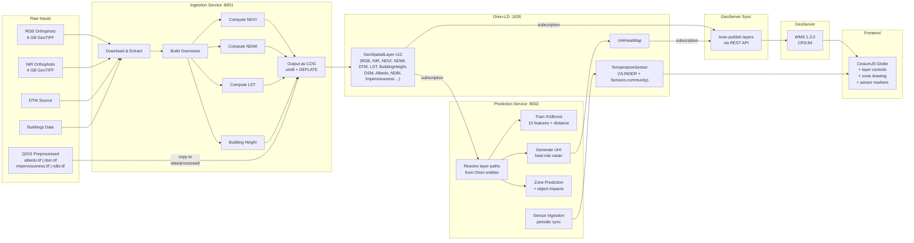
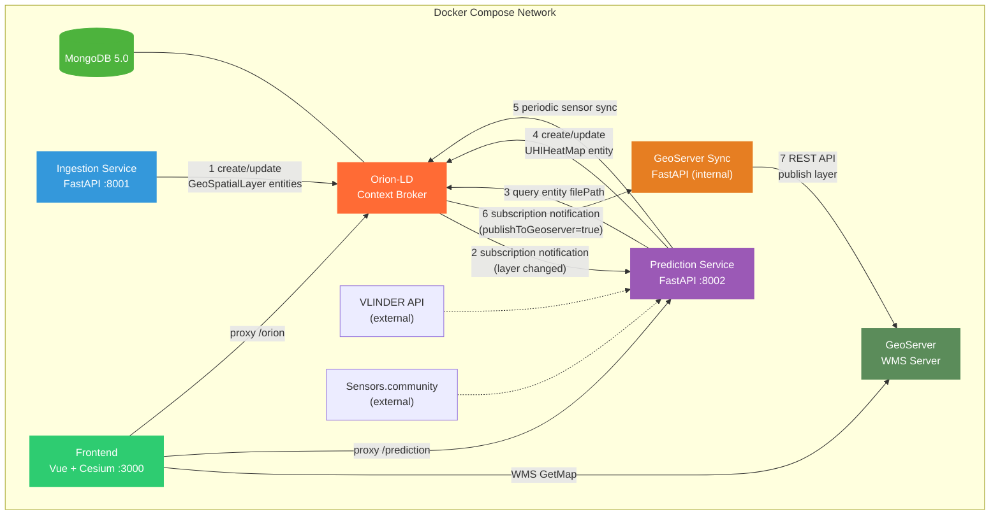
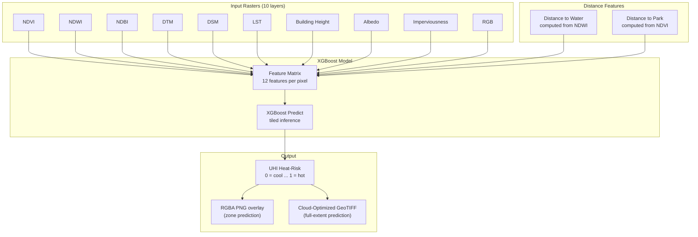
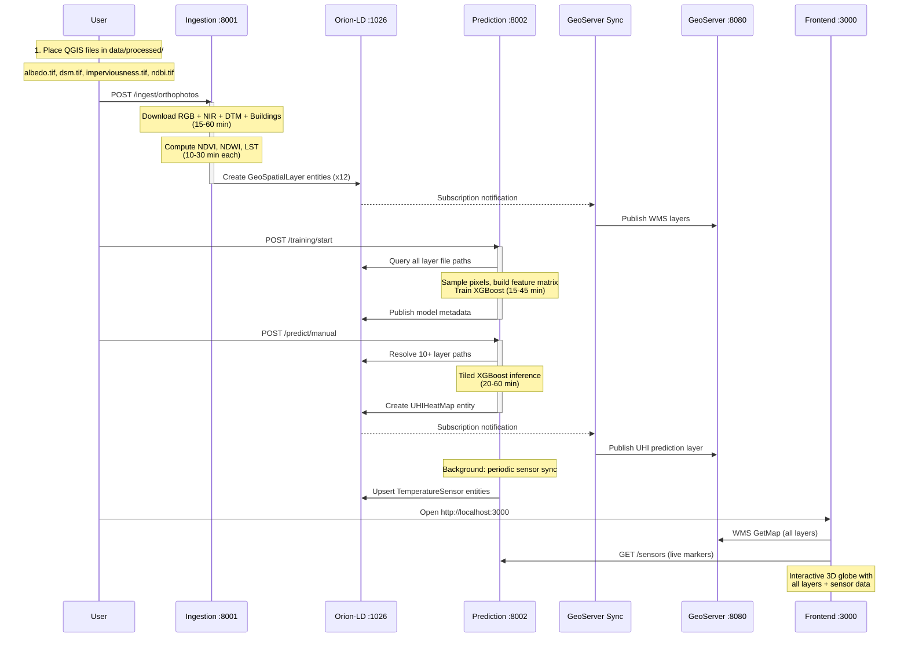

# Urban Heat Island (UHI) Monitoring Platform

A FIWARE-based microservice platform for monitoring and predicting **Urban Heat Islands** in Brussels. The system ingests multi-source geospatial data, trains an XGBoost machine-learning model on 10+ raster layers, generates heat-risk predictions, ingests real-time sensor data, and serves everything through an interactive 3D web viewer.

Built on [FIWARE Orion-LD](https://github.com/FIWARE/context.Orion-LD) (NGSI-LD Context Broker) as the central data backbone — all services communicate through Orion entities and subscriptions in a fully **event-driven** architecture.

---

## Architecture

### Global Data Flow

This diagram traces the complete journey of data from raw inputs to the browser:



### Service Communication

Orion-LD acts as the central message bus. Services register entities and subscribe to changes — no service calls another directly.



### XGBoost Prediction Pipeline

The ML model combines 10 raster features + 2 computed distance features to predict heat-risk intensity:



---

## Project Structure

```
uhi-fiware-poc/
├── docker-compose.yml              # Orchestrates all 7 services
├── env.example                     # Template for environment variables
├── .env                            # Active config (git-ignored, copy from env.example)
│
├── services/
│   ├── ingestion/                  # Downloads orthophotos, computes indices
│   │   ├── main.py                 # FastAPI app
│   │   ├── config.py               # Environment variable config
│   │   ├── api/                    # HTTP endpoints
│   │   ├── fiware/client.py        # Orion-LD NGSI-LD client
│   │   ├── pipeline/               # Download & orchestration logic
│   │   ├── processors/             # NDVI, NDWI, LST, DTM, COG utilities
│   │   ├── Dockerfile
│   │   └── README.md
│   │
│   ├── prediction/                 # UHI prediction engine + sensor ingestion
│   │   ├── main.py                 # FastAPI app + service wiring
│   │   ├── algorithm/
│   │   │   ├── config.py           # Pydantic Settings (all env vars)
│   │   │   ├── api/                # Routers (prediction, training, zone, sensor)
│   │   │   ├── application/        # Orchestrators (prediction, training, zone)
│   │   │   ├── domain/             # Business logic (raster engine, layer decoder)
│   │   │   └── infrastructure/     # Orion client, layer resolver, sensor providers
│   │   ├── Dockerfile
│   │   └── README.md
│   │
│   ├── geoserver-sync/             # Auto-publishes layers to GeoServer
│   │   ├── main.py                 # FastAPI app
│   │   ├── src/                    # Config, Orion handler, GeoServer client, styles
│   │   ├── Dockerfile
│   │   └── README.md
│   │
│   └── frontend/                   # 3D web viewer
│       ├── src/
│       │   ├── App.vue             # Root component
│       │   ├── components/         # CesiumViewer, LayerControls, PredictionPanel, ...
│       │   ├── composables/        # Reusable logic (camera, drawing, sensors, WMS, ...)
│       │   └── services/           # API clients (Orion, Prediction)
│       ├── nginx.conf              # Reverse proxy (GeoServer, Orion, Prediction)
│       ├── Dockerfile
│       └── README.md
│
├── data/                           # Mounted volumes (git-ignored)
│   ├── raw/                        # Downloaded orthophotos + source data
│   ├── processed/                  # NDVI, NDWI, LST, UHI, + QGIS preprocessed files
│   ├── models/                     # Trained XGBoost model artifacts
│   └── cache/                      # Intermediate processing cache
│
└── config/
    └── geoserver/                  # GeoServer workspace config (runtime, git-ignored)
```

---

## Quick Start

### Prerequisites

| Requirement | Minimum | Recommended |
|---|---|---|
| [Docker](https://docs.docker.com/get-docker/) + [Docker Compose](https://docs.docker.com/compose/install/) | v2+ | Latest |
| RAM | 8 GB | 16 GB |
| Disk space | 15 GB | 30 GB |
| OS | Windows 10/11, macOS, Linux | Any with Docker support |

### Step 1 — Clone the repository

```bash
git clone <repo-url>
cd uhi-fiware-poc
```

### Step 2 — Configure environment variables

```bash
cp env.example .env
```

The default `.env` points to the Brussels 2024 UrbIS orthophotos. Edit if needed.

### Step 3 — Place QGIS preprocessed raster files

> **Important:** Four raster layers must be preprocessed externally with QGIS and placed manually in `data/processed/` **before** running the prediction. These files are provided separately.

```bash
mkdir -p data/processed
```

Copy the following files into `data/processed/`:

| File | Description | Source |
|---|---|---|
| `albedo.tif` | Surface albedo (reflectivity) | Preprocessed in QGIS from satellite data |
| `dsm.tif` | Digital Surface Model (elevation including buildings/trees) | Preprocessed in QGIS from LiDAR/Copernicus |
| `imperviousness.tif` | Soil imperviousness index (0-100%) | Preprocessed in QGIS from Copernicus HRL |
| `ndbi.tif` | Normalized Difference Built-up Index | Preprocessed in QGIS from satellite bands |

These files must be **GeoTIFF format**, projected in **EPSG:31370** (Belgian Lambert 72), and cover the **Brussels Capital Region**. They are used as input features for the XGBoost UHI prediction model.

### Step 4 — Start all services

```bash
docker compose up -d
```

This starts 7 containers:

| Service | Container | Port | Description |
|---|---|---|---|
| MongoDB | `uhi-mongo` | 27017 | Orion-LD database |
| Orion-LD | `uhi-orion` | 1026 | NGSI-LD Context Broker |
| GeoServer | `uhi-geoserver` | 8080 | WMS tile server |
| Ingestion | `uhi-ingestion` | 8001 | Data ingestion pipeline |
| Prediction | `uhi-prediction` | 8002 | UHI prediction engine + sensor sync |
| GeoServer Sync | `uhi-geoserver-sync` | _(internal)_ | Auto-publishes layers to GeoServer |
| Frontend | `uhi-frontend` | 3000 | CesiumJS 3D web viewer |

Verify all containers are healthy:

```bash
docker compose ps
```

### Step 5 — Trigger the ingestion pipeline

```bash
curl -X POST http://localhost:8001/ingest/orthophotos \
  -H "Content-Type: application/json" -d '{}'
```

Monitor progress:

```bash
curl http://localhost:8001/status
```

> **Warning: Ingestion takes a long time.**
> The pipeline downloads ~10 GB of orthophotos and processes them into multiple spectral indices. Depending on your internet speed and hardware:
> - **Download:** 15–60 minutes (skipped if files already exist)
> - **Overview building:** 5–15 minutes per file
> - **NDVI/NDWI/LST computation:** 10–30 minutes each (windowed processing on 4–6 GB files)
> - **Total:** 1–3 hours on first run
>
> Monitor logs for real-time progress:
> ```bash
> docker logs uhi-ingestion --tail 50 -f
> ```

The pipeline will:
1. Download RGB and NIR orthophotos, DTM, and Buildings data (~10 GB total)
2. Build overviews on the raw files (for fast WMS serving)
3. Compute NDVI, NDWI, and LST as Cloud-Optimized GeoTIFFs
4. Compute Building Height from DSM and DTM
5. Register all layers as NGSI-LD entities in Orion-LD

This automatically triggers:
- **GeoServer Sync** — publishes all layers to GeoServer as WMS

### Step 6 — Train the XGBoost prediction model

Once ingestion is complete **and** the 4 QGIS files are in place, train the model:

```bash
curl -X POST http://localhost:8002/training/start
```

Monitor training progress:

```bash
curl http://localhost:8002/training/status
```

> **Warning: Training can take 15–45 minutes** depending on your hardware (GPU recommended).
> The model samples pixels across all 10+ input layers, builds a feature matrix, and trains an XGBoost regressor. Monitor logs:
> ```bash
> docker logs uhi-prediction --tail 50 -f
> ```

### Step 7 — Generate the full UHI prediction

Once the model is trained, trigger a full-extent prediction:

```bash
curl -X POST http://localhost:8002/predict/manual
```

> **Warning: Full-extent prediction takes 20–60 minutes.** It runs tiled XGBoost inference across the entire Brussels raster extent. Progress is tracked in the logs.

This creates the `UHIHeatMap` entity in Orion, which automatically triggers GeoServer Sync to publish the prediction layer.

### Step 8 — View the results

Open [http://localhost:3000](http://localhost:3000) in your browser.

The CesiumJS 3D viewer provides:
- Toggle-able WMS layers (RGB, NIR, NDVI, NDWI, LST, UHI Prediction, ...)
- Per-layer opacity sliders
- Pixel click to query values across all layers
- Polygon drawing for zone-specific predictions
- Object impact simulation (trees, buildings, solar panels, ...)
- Real-time sensor markers (VLINDER + Sensors.community)
- Sun position simulation

---

## Complete Workflow Diagram



---

## NGSI-LD Data Model

### GeoSpatialLayer

Represents a geospatial raster layer:

| Property | Type | Example |
|---|---|---|
| `id` | string | `urn:ngsi-ld:GeoSpatialLayer:NDVI:brussels:2024` |
| `type` | string | `GeoSpatialLayer` |
| `layerType` | Property | `RGB`, `NIR`, `NDVI`, `NDWI`, `DTM`, `LST`, `BuildingHeight`, `DSM`, `Albedo`, `NDBI`, `Imperviousness` |
| `name` | Property | Human-readable name |
| `filePath` | Property | Container-internal path to GeoTIFF |
| `geoserverLayer` | Property | GeoServer layer name (e.g. `uhi:ndvi`) |
| `publishToGeoserver` | Property | `true` if the layer should be served via WMS |
| `boundingBox` | GeoProperty | WGS84 bounding polygon |
| `resolution` | Property | Spatial resolution in cm |

### UHIHeatMap

Represents a heat-risk prediction output:

| Property | Type | Example |
|---|---|---|
| `id` | string | `urn:ngsi-ld:UHIHeatMap:brussels:2024` |
| `type` | string | `UHIHeatMap` |
| `modelVersion` | Property | `xgb_v1` |
| `inputLayers` | Property | Array of input entity IDs |
| `filePath` | Property | Path to prediction GeoTIFF |
| `valueRange` | Property | `{min: 0, max: 1}` (0 = cool, 1 = hot) |

### TemperatureSensor

Represents a real-time sensor observation:

| Property | Type | Example |
|---|---|---|
| `id` | string | `urn:ngsi-ld:TemperatureSensor:vlinder:ukkel_kmi` |
| `type` | string | `TemperatureSensor` |
| `provider` | Property | `vlinder`, `sensors_community` |
| `temperature` | Property | `22.5` (with `observedAt`) |
| `humidity` | Property | `65.0` (with `observedAt`) |
| `location` | GeoProperty | Point with WGS84 coordinates |

---

## API Reference

### Ingestion Service (`:8001`)

| Method | Endpoint | Description |
|---|---|---|
| `POST` | `/ingest/orthophotos` | Start ingestion pipeline |
| `GET` | `/status` | Current pipeline status |
| `GET` | `/layers` | List registered layers from Orion |
| `GET` | `/health` | Health check |

### Prediction Service (`:8002`)

| Method | Endpoint | Description |
|---|---|---|
| `POST` | `/predict` | Orion subscription callback (auto) |
| `POST` | `/predict/manual` | Manual full-extent prediction trigger |
| `POST` | `/training/start` | Start XGBoost model training |
| `GET` | `/training/status` | Training progress |
| `POST` | `/zones/predict` | Zone prediction (GeoJSON polygon + objects) |
| `POST` | `/zones/stats` | Zone statistics (mean/min/max per layer) |
| `GET` | `/zones/pixel?lon=X&lat=Y` | Single pixel value lookup |
| `POST` | `/zones/export` | Export zone as GeoTIFF |
| `GET` | `/sensors` | List latest sensor readings |
| `POST` | `/sensors/sync` | Manual sensor sync trigger |
| `GET` | `/vlinder/tbase` | Temperature baseline (rural reference) |
| `GET` | `/health` | Health check |

### GeoServer Sync (internal)

| Method | Endpoint | Description |
|---|---|---|
| `POST` | `/sync` | Orion notification handler |
| `POST` | `/sync/all` | Force full re-sync |
| `GET` | `/health` | Health check |

---

## Useful Commands

```bash
# --- Service Management ---

# Check all containers status
docker compose ps

# View service logs (follow mode)
docker logs uhi-ingestion --tail 50 -f
docker logs uhi-prediction --tail 50 -f
docker logs uhi-geoserver-sync --tail 50 -f

# Restart a specific service
docker compose restart prediction

# --- Orion-LD Inspection ---

# List all entities
curl -s "http://localhost:1026/ngsi-ld/v1/entities?local=true" \
  -H "Accept: application/json" | python3 -m json.tool

# List subscriptions
curl -s "http://localhost:1026/ngsi-ld/v1/subscriptions" \
  -H "Accept: application/json" | python3 -m json.tool

# --- GeoServer ---

# List published layers
curl -s -u admin:geoserver \
  "http://localhost:8080/geoserver/rest/workspaces/uhi/coverages.json" | python3 -m json.tool

# Force re-publish all layers
docker exec uhi-geoserver-sync curl -s -X POST http://localhost:8000/sync/all

# --- Prediction & Sensors ---

# Manually trigger prediction
curl -X POST http://localhost:8002/predict/manual

# Train model
curl -X POST http://localhost:8002/training/start

# Check training status
curl http://localhost:8002/training/status

# List live sensor readings
curl http://localhost:8002/sensors

# --- Clean Restart ---

# Full reset (removes all data)
docker compose down -v
rm -rf data/raw data/processed data/models data/cache config/geoserver
docker compose up -d
# Remember to re-place the QGIS files in data/processed/ after reset!
```

---

## Key Design Decisions

### Event-driven via Orion subscriptions

No service calls another directly. Services register entities and subscribe to changes in Orion-LD. This decouples the system and makes it extensible — adding a new layer type or a new consumer requires no changes to existing services.

### No hardcoded file paths

The prediction service knows only entity IDs (configurable via environment variables). At runtime it queries Orion for `filePath` properties. If entities don't exist, the prediction fails explicitly rather than silently using stale data.

### Cloud-Optimized GeoTIFFs (COG)

All output rasters are saved as uint8 COGs with DEFLATE compression, 512x512 internal tiles, and multi-level overviews. This gives 10-100x faster WMS serving compared to raw float32 GeoTIFFs.

### Windowed processing

Large rasters (4-6 GB) are processed in 2048x2048 tiles to keep peak memory usage under control, avoiding OOM crashes.

### Multi-provider sensor ingestion

The sensor pipeline is designed with an abstract `BaseSensorProvider` interface. Adding a new sensor network (e.g., IRM, OpenWeather) requires only implementing a single class with a `fetch_readings()` method.

### Automatic GeoServer sync

Any entity with `publishToGeoserver: true` is automatically published to GeoServer. No manual layer creation needed.

---

## Technology Stack

| Component | Technology | Role |
|---|---|---|
| Context Broker | [FIWARE Orion-LD](https://github.com/FIWARE/context.Orion-LD) 1.6.0 | NGSI-LD entity & subscription management |
| Database | MongoDB 5.0 | Orion-LD persistence |
| GIS Server | GeoServer 2.24.2 | WMS layer serving |
| Ingestion | Python 3.11 / FastAPI | Data download & raster processing |
| Prediction | Python 3.11 / FastAPI / XGBoost | ML-based UHI prediction + sensor ingestion |
| GeoServer Sync | Python 3.11 / FastAPI | Automated GeoServer configuration |
| Frontend | Vue 3 / CesiumJS 1.114.0 | Interactive 3D globe viewer |
| Base Map | OpenStreetMap | Base layer tiles |
| Raster Processing | Rasterio / NumPy / SciPy | GeoTIFF I/O & computation |
| ML Engine | XGBoost / scikit-learn | Heat-risk model training & inference |

---

## License

This project is developed by [FARI -- AI for the Common Good Institute](https://fari.brussels).
