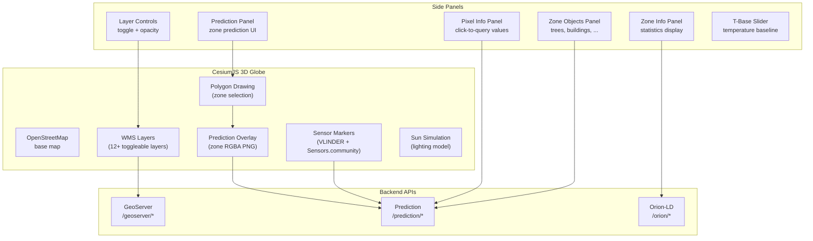
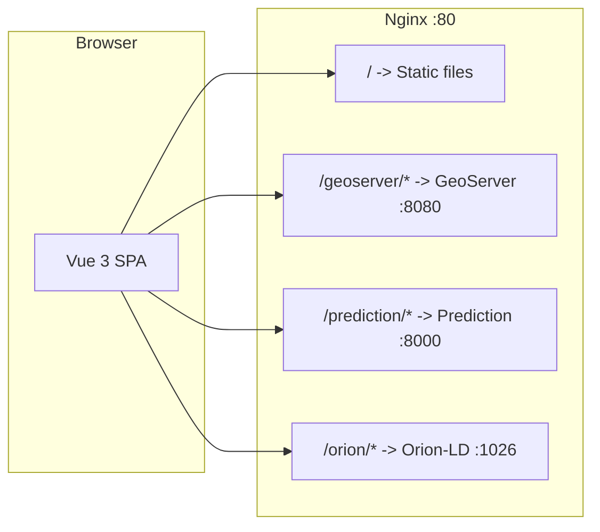

# Frontend -- UHI Viewer

A **Vue 3 + CesiumJS** web application for visualizing Urban Heat Island data on an interactive 3D globe. Displays WMS layers served by GeoServer, real-time sensor markers, and supports interactive zone prediction with object impact simulation.

## Features



### Core Capabilities

- **3D globe** powered by [CesiumJS 1.114.0](https://cesium.com/cesiumjs/) with OpenStreetMap base
- **12+ WMS layers**: RGB, NIR, NDVI, NDWI, LST, DTM, DSM, Building Height, Albedo, NDBI, Imperviousness, UHI Prediction
- **Per-layer opacity control** with gradient legends
- **Pixel click query** -- click any point to see decoded values across all layers
- **Zone prediction** -- draw a polygon, optionally add objects (trees, buildings, solar panels), get UHI prediction
- **Object impact simulation** -- see how urban planning changes affect heat-risk
- **Real-time sensor markers** -- VLINDER + Sensors.community stations with temperature, humidity, wind data
- **Sun position simulation** -- solar lighting model based on time of day
- **Zone statistics** -- mean, min, max values per layer for any drawn zone
- **GeoTIFF export** -- download zone prediction as a raster file

## Available WMS Layers

| Layer | WMS Name | Description |
|---|---|---|
| RGB Orthophoto | `uhi:rgb` | True-color aerial imagery |
| NIR Orthophoto | `uhi:nir` | Near-infrared imagery |
| NDVI | `uhi:ndvi` | Vegetation index (-1 to 1) |
| NDWI | `uhi:ndwi` | Water index (-1 to 1) |
| NDBI | `uhi:ndbi` | Built-up index (-1 to 1) |
| DTM | `uhi:dtm` | Digital Terrain Model |
| DSM | `uhi:dsm` | Digital Surface Model |
| LST | `uhi:lst` | Land Surface Temperature |
| Building Height | `uhi:buildingheight` | Building height in meters |
| Albedo | `uhi:albedo` | Surface reflectivity |
| Imperviousness | `uhi:imperviousness` | Soil sealing (0-100%) |
| UHI Prediction | `uhi:uhi_prediction` | Heat risk (0 = cool, 1 = hot) |

## Architecture



The Nginx reverse proxy routes all backend requests through the same origin, avoiding CORS issues entirely.

## Development

### Local development (without Docker)

```bash
cd services/frontend
npm install
npm run dev
# -> http://localhost:5173
```

Note: for local dev, the app auto-detects the port and uses `http://localhost:8080/geoserver` directly.

### Production build

The Dockerfile uses a multi-stage build:

1. **Build stage**: `node:20-alpine` runs `npm run build`
2. **Serve stage**: `nginx:alpine` serves the static files

```bash
docker build -t uhi-frontend .
docker run -p 3000:80 uhi-frontend
```

## Project Structure

```
frontend/
├── src/
│   ├── main.js                          # Vue app entry point
│   ├── App.vue                          # Root component, layer definitions
│   ├── App.js                           # App logic & state management
│   ├── App.css                          # Global styles
│   │
│   ├── components/
│   │   ├── CesiumViewer/                # 3D globe + WMS layer rendering
│   │   │   ├── CesiumViewer.vue
│   │   │   └── CesiumViewer.js
│   │   ├── LayerControls/               # Layer toggle panel + opacity sliders
│   │   │   ├── LayerControls.vue
│   │   │   └── LayerControls.css
│   │   ├── PredictionPanel/             # Zone prediction UI
│   │   │   ├── PredictionPanel.vue
│   │   │   └── PredictionPanel.css
│   │   ├── SelectionOverlay/            # Polygon drawing interface
│   │   │   └── SelectionOverlay.vue
│   │   ├── ZoneInfoPanel/               # Zone metadata + statistics
│   │   │   ├── ZoneInfoPanel.vue
│   │   │   └── ZoneInfoPanel.css
│   │   ├── ZoneObjectsPanel.vue         # Drag-and-drop urban objects
│   │   ├── PixelInfoPanel.vue           # Click-to-query values
│   │   └── TBaseSlider.vue              # Temperature baseline slider
│   │
│   ├── composables/                     # Vue 3 Composition API functions
│   │   ├── App/
│   │   │   ├── useWorkflow.js           # UI workflow orchestration
│   │   │   ├── usePixelQuery.js         # Single-pixel value lookups
│   │   │   ├── useLayerInfo.js          # Layer metadata from Orion
│   │   │   ├── useDownload.js           # GeoTIFF export
│   │   │   └── useDraggable.js          # Draggable panel state
│   │   └── Cesium/
│   │       ├── useWmsLayers.js          # WMS layer creation + management
│   │       ├── usePredictionOverlay.js  # Zone prediction PNG overlay
│   │       ├── useDrawing.js            # Polygon drawing on globe
│   │       ├── useSensorMarkers.js      # Real-time sensor markers
│   │       ├── useSunSimulation.js      # Sun position calculation
│   │       ├── usePixelClick.js         # Map click handling
│   │       └── useCameraControls.js     # Camera positioning/flight
│   │
│   └── services/                        # API clients
│       ├── api.js                       # Generic HTTP client (via Nginx proxy)
│       ├── orionApi.js                  # Orion-LD entity CRUD
│       └── predictionApi.js             # Prediction + sensor endpoints
│
├── index.html                           # HTML entry point
├── nginx.conf                           # Reverse proxy configuration
├── vite.config.js                       # Vite + Cesium asset plugin
├── package.json                         # Dependencies
├── Dockerfile                           # Multi-stage build
└── .dockerignore
```

## Key Components

### CesiumViewer

Initializes the CesiumJS Viewer with OSM base layer. Manages WMS imagery layers via `WebMapServiceImageryProvider` using WMS 1.3.0 with `CRS:84` (longitude-first axis order). Watches for layer visibility/opacity changes from parent state.

### LayerControls

Collapsible side panel with checkbox toggles per layer, range slider for opacity, and gradient legends for index layers (NDVI, NDWI, UHI, etc.).

### PredictionPanel + SelectionOverlay

Drawing interface for user-defined zones. Calls the zone prediction API with GeoJSON polygon + optional objects. Displays the returned RGBA PNG as a `SingleTileImageryProvider` overlay on the globe.

### ZoneInfoPanel + ZoneObjectsPanel

Zone metadata display (bounding box, pixel count, statistics). Drag-and-drop interface for placing urban objects (trees, buildings, solar panels, water fountains) and seeing their predicted impact on heat-risk.

### Sensor Markers (useSensorMarkers.js)

Periodically polls the `/sensors` endpoint and places markers on the globe for each active station. Displays temperature, humidity, wind data on click.

## Dependencies

- **Vue 3** -- reactive UI framework
- **CesiumJS 1.114.0** -- 3D globe rendering
- **Vite** -- build tool
- **vite-plugin-cesium** -- copies Cesium assets at build time
- **Font Awesome 6.5.1** -- icons
