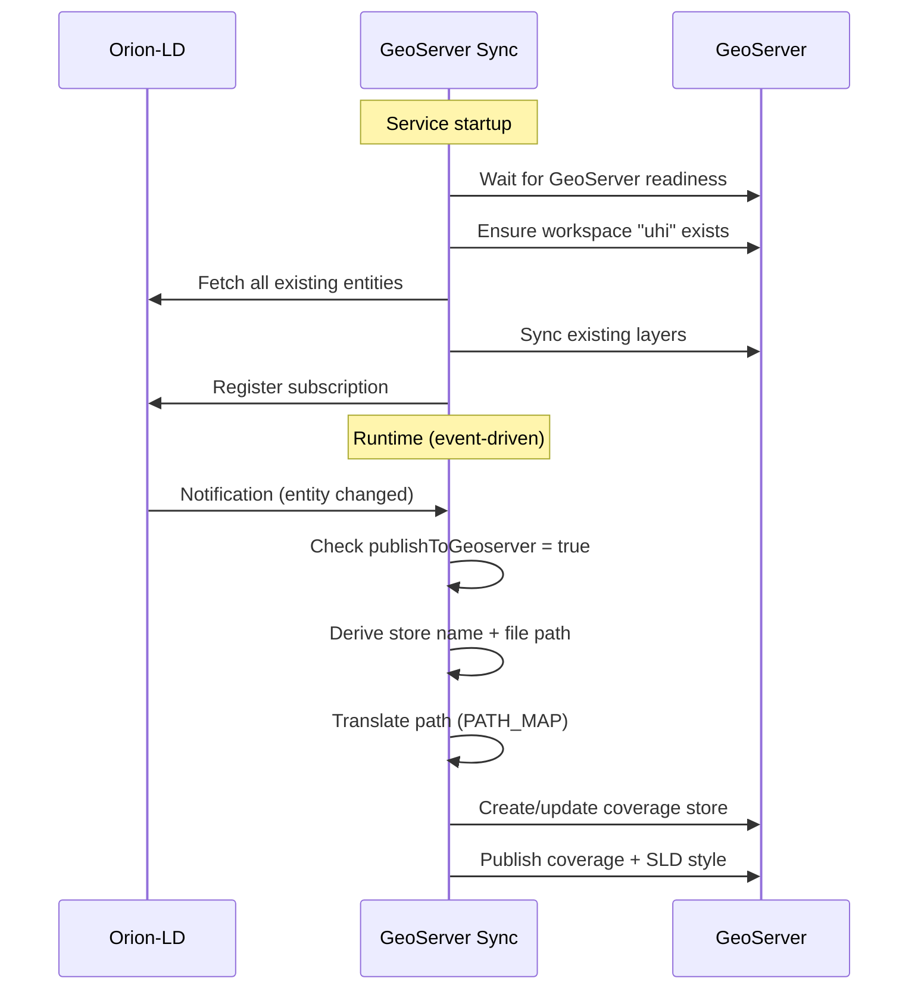

# GeoServer Sync Service

FastAPI microservice that **automatically publishes geospatial layers to GeoServer** based on Orion-LD entity state. Any NGSI-LD entity with `publishToGeoserver: true` gets a corresponding GeoServer coverage store and coverage created via the GeoServer REST API.

## How It Works



### Startup Sequence

1. **Wait** for GeoServer to be reachable
2. **Ensure** workspace `uhi` exists (create if missing)
3. **Sync** all existing Orion entities to GeoServer
4. **Register** its Orion subscription for future changes

### Runtime Behavior

- Receives notifications from Orion when entities change
- Checks `publishToGeoserver` property
- Derives store name and coverage name from entity properties
- Translates container file paths to GeoServer-internal paths
- Creates/updates the GeoServer layer via REST API
- Applies SLD style based on layer type (NDVI, NDWI, UHI, etc.)

## API Endpoints

| Method | Endpoint | Description |
|---|---|---|
| `POST` | `/sync` | Orion notification handler (called automatically) |
| `POST` | `/sync/all` | Force a full re-sync of all Orion entities to GeoServer |
| `GET` | `/health` | Health check |

### Force re-sync

The service is not exposed to the host by default. Use `docker exec`:

```bash
docker exec uhi-geoserver-sync curl -s -X POST http://localhost:8000/sync/all
```

## Environment Variables

| Variable | Default | Description |
|---|---|---|
| `ORION_URL` | `http://orion:1026` | Orion-LD broker URL |
| `GEOSERVER_URL` | `http://geoserver:8080/geoserver` | GeoServer REST API URL |
| `GEOSERVER_USER` | `admin` | GeoServer admin username |
| `GEOSERVER_PASSWORD` | `geoserver` | GeoServer admin password |
| `GEOSERVER_WORKSPACE` | `uhi` | GeoServer workspace name |
| `SELF_URL` | `http://geoserver-sync:8000` | URL where Orion can reach this service |
| `PATH_MAP_PROCESSED` | `/data/processed:/opt/geoserver_data/data/uhi_processed` | Container path to GeoServer path |
| `PATH_MAP_RAW` | `/data/raw:/opt/geoserver_data/data/uhi_raw` | Container path to GeoServer path |

## Orion Subscription

The service subscribes to changes on:

| Entity Type | Watched Attributes |
|---|---|
| `GeoSpatialLayer` | `publishToGeoserver`, `filePath` |
| `UHIHeatMap` | `publishToGeoserver`, `filePath` |

## Layer Derivation Logic

The service derives GeoServer layer parameters from entity properties:

| Entity Type | Store Name | Coverage Name | Title |
|---|---|---|---|
| `GeoSpatialLayer` | `store_{layerType}` | `{layerType}` (lowercase) | `name` property |
| `UHIHeatMap` | `store_uhi_prediction` | `uhi_prediction` | `name` property |

### SLD Styles

Each layer type gets a specific SLD color ramp:

| Layer | Style | Scale |
|---|---|---|
| NDVI, NDWI, NDBI | Diverging blue-green-red | -1 to 1 |
| UHI Prediction | RdYlBu (Red-Yellow-Blue) | 0 to 1 |
| DTM, DSM, Building Height | Terrain gradient | Physical units |
| LST | Temperature gradient | Kelvin |
| Imperviousness | Gray-to-red | 0-100% |
| RGB, NIR | Default raster | Native bands |

## Project Structure

```
geoserver-sync/
├── main.py              # FastAPI app + lifespan startup
├── Dockerfile
├── requirements.txt
└── src/
    ├── config.py        # Service configuration
    ├── orion.py         # Orion subscription & notification handler
    ├── geoserver.py     # GeoServer REST API client
    └── styles.py        # SLD style definitions per layer type
```

## Dependencies

- **FastAPI** / **Uvicorn** -- async web framework
- **httpx** -- HTTP client (sync for GeoServer REST API, async for Orion)
