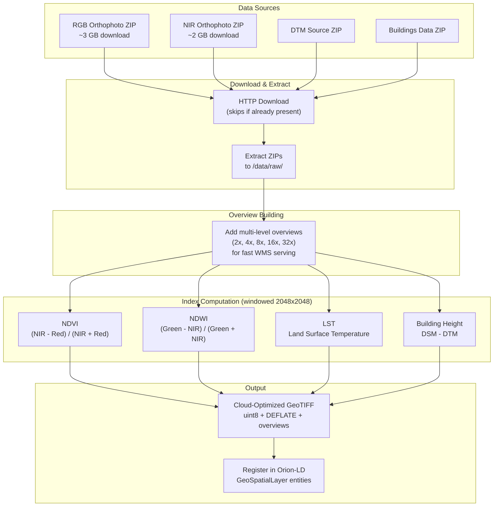

# Ingestion Service

FastAPI microservice that downloads orthophotos from [UrbIS](https://datastore.brussels), computes spectral indices (NDVI, NDWI, LST), extracts building heights, and registers all layers as NGSI-LD entities in Orion-LD.

## How It Works



## Responsibilities

1. **Download** RGB, NIR, DTM, and Buildings data (ZIP archives with GeoTIFF inside)
2. **Build overviews** on the raw files for fast WMS serving
3. **Compute NDVI** -- Normalized Difference Vegetation Index
4. **Compute NDWI** -- Normalized Difference Water Index
5. **Compute LST** -- Land Surface Temperature
6. **Extract Building Height** from DSM and DTM
7. **Register entities** in Orion-LD (`GeoSpatialLayer` entities for each layer)

All outputs are Cloud-Optimized GeoTIFFs (uint8, DEFLATE compressed, internally tiled, with overviews).

## Processing Times

> **Important:** The ingestion pipeline processes very large raster files (4-6 GB each). Expect significant processing times:

| Step | Duration | Notes |
|---|---|---|
| Download RGB + NIR | 15-60 min | ~10 GB total, depends on internet speed |
| Download DTM + Buildings | 5-15 min | Smaller files |
| Build overviews | 5-15 min per file | I/O intensive |
| Compute NDVI | 10-30 min | Windowed processing on full-resolution rasters |
| Compute NDWI | 10-30 min | Same windowed approach |
| Compute LST | 10-30 min | Requires multiple input bands |
| Building Height | 5-10 min | DSM - DTM differencing |
| **Total (first run)** | **1-3 hours** | Downloads are skipped on subsequent runs |

Monitor progress in real-time:
```bash
docker logs uhi-ingestion --tail 50 -f
```

## API Endpoints

| Method | Endpoint | Description |
|---|---|---|
| `POST` | `/ingest/orthophotos` | Trigger the ingestion pipeline. Body is optional -- uses env URLs if omitted. |
| `GET` | `/status` | Returns current pipeline status (`running`, `progress`, `layers_created`). |
| `GET` | `/layers` | Lists all `GeoSpatialLayer` entities from Orion. |
| `GET` | `/health` | Health check. |

### Trigger ingestion

```bash
# Use default URLs from env
curl -X POST http://localhost:8001/ingest/orthophotos \
  -H "Content-Type: application/json" -d '{}'

# Custom URLs
curl -X POST http://localhost:8001/ingest/orthophotos \
  -H "Content-Type: application/json" \
  -d '{"rgb_url": "https://...", "nir_url": "https://..."}'
```

### Monitor progress

```bash
curl http://localhost:8001/status
# {"running": true, "progress": "Calculating NDVI...", "layers_created": ["RGB", "NIR"]}
```

## Environment Variables

| Variable | Default | Description |
|---|---|---|
| `ORION_URL` | `http://orion:1026` | Orion-LD broker URL |
| `DATA_RAW_PATH` | `/data/raw` | Path for downloaded files |
| `DATA_PROCESSED_PATH` | `/data/processed` | Path for computed outputs |
| `RGB_URL` | _(from .env)_ | Default download URL for RGB orthophoto |
| `NIR_URL` | _(from .env)_ | Default download URL for NIR orthophoto |
| `DTM_URL` | _(from .env)_ | Default download URL for DTM data |
| `BUILDINGS_AND_ENGINEERING_WORKS_URL` | _(from .env)_ | Default download URL for buildings data |

## Smart Download

If the `data/raw/rgb/` and `data/raw/nir/` directories already contain TIFF files, the download step is **skipped entirely**. This avoids re-downloading ~10 GB on every restart.

## Windowed Processing

All indices (NDVI, NDWI, LST) are computed in **2048x2048 pixel tiles** to avoid loading the full 4-6 GB rasters into memory. This keeps peak RAM usage manageable and avoids OOM crashes.

## COG Output Format

| Property | Value |
|---|---|
| Data type | `uint8` (0-254 data, 255 nodata) |
| Compression | DEFLATE with horizontal predictor |
| Tile size | 512x512 |
| Overviews | 2x, 4x, 8x, 16x, 32x |
| Encoding | `[-1, 1] -> [0, 254]` |

Decode formula: `value = (pixel / 254) * 2 - 1`

## Project Structure

```
ingestion/
├── main.py                  # FastAPI app entry point
├── config.py                # Centralized environment config
├── api/
│   ├── routes.py            # HTTP endpoint definitions
│   └── models.py            # Pydantic request/response schemas
├── fiware/
│   └── client.py            # Orion-LD NGSI-LD entity management
├── pipeline/
│   ├── run.py               # Main ingestion orchestrator
│   └── download.py          # HTTP download + ZIP extraction
├── processors/
│   ├── ndvi.py              # NDVI = (NIR - Red) / (NIR + Red)
│   ├── ndwi.py              # NDWI = (Green - NIR) / (Green + NIR)
│   ├── lst.py               # Land Surface Temperature
│   ├── dtm.py               # Digital Terrain Model processing
│   ├── building_height.py   # Building height = DSM - DTM
│   ├── get_dtm.py           # DTM acquisition with retry
│   ├── cog.py               # COG utilities (uint8 output)
│   ├── cog_float32.py       # COG utilities (float32 output)
│   └── utils.py             # Shared raster I/O helpers
├── Dockerfile
└── requirements.txt
```

## NGSI-LD Entity Output

Each layer is registered as a `GeoSpatialLayer` entity with:

- `filePath` -- container-internal path to the GeoTIFF
- `geoserverLayer` -- expected GeoServer layer name (e.g. `uhi:ndvi`)
- `publishToGeoserver: true` -- signals geoserver-sync to publish it
- `boundingBox` -- WGS84 bounding polygon (reprojected from Belgian Lambert 72)
- `layerType`, `spectralRange`, `resolution`, etc.

## Dependencies

- **FastAPI** / **Uvicorn** -- async web framework
- **Rasterio** / **GDAL** -- GeoTIFF I/O with windowed reading
- **NumPy** -- raster computation
- **httpx** -- async HTTP client (for downloads and Orion API)
