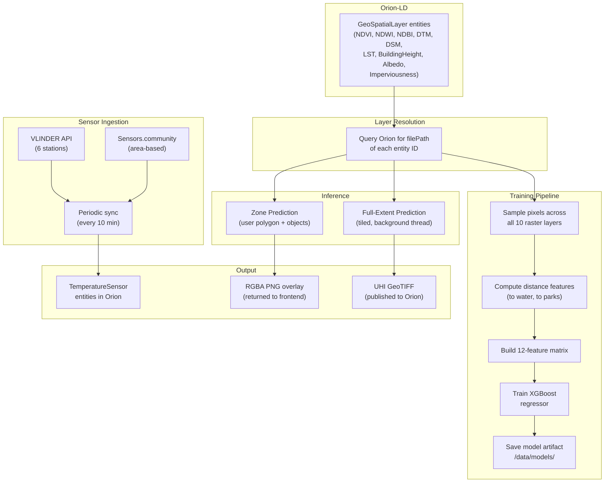
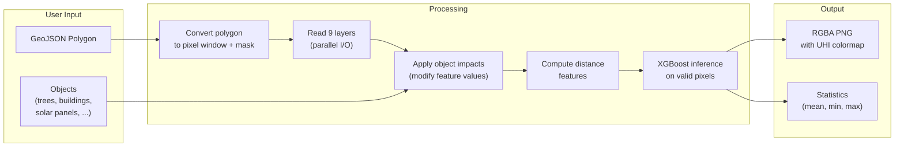
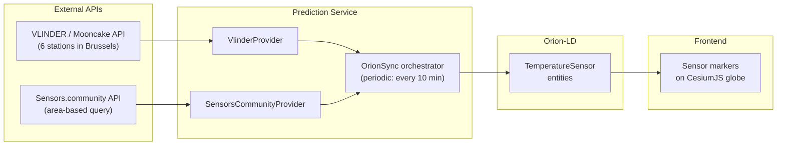

# Prediction Service

FastAPI microservice that generates **Urban Heat Island (UHI) heat-risk predictions** using an XGBoost machine-learning model trained on 10+ geospatial raster layers. It also ingests real-time sensor data from multiple providers (VLINDER, Sensors.community) and exposes interactive zone prediction for user-drawn polygons.

All input file paths are resolved from Orion-LD at runtime -- no paths are hardcoded.

## How It Works



## Architecture Principles

1. **Input paths come from Orion** -- the service queries Orion-LD entities to discover where raster files live on disk. If Orion is unreachable or entities don't exist, the operation fails explicitly.
2. **Only entity IDs are configured** -- environment variables like `NDVI_ENTITY_ID`, `DTM_ENTITY_ID`, etc. tell the service which Orion entities to query. Everything else is resolved at runtime.
3. **Scoped subscription** -- the Orion subscription watches specific input entities, not all `GeoSpatialLayer` entities.
4. **Debounce lock** -- `asyncio.Lock` prevents concurrent predictions.
5. **Self-registering** -- the service registers its own Orion subscription on startup.
6. **Extensible sensor providers** -- new data sources are added by implementing a single `BaseSensorProvider` class.

## API Endpoints

### Prediction & Training

| Method | Endpoint | Description |
|---|---|---|
| `POST` | `/predict` | Orion subscription callback (auto-triggered) |
| `POST` | `/predict/manual` | Manual full-extent prediction (always runs) |
| `POST` | `/training/start` | Start XGBoost model training |
| `GET` | `/training/status` | Poll training progress |
| `GET` | `/training/latest` | Get latest model metadata |

### Zone Prediction

| Method | Endpoint | Description |
|---|---|---|
| `POST` | `/zones/predict` | Predict UHI for a GeoJSON polygon (+ optional objects) |
| `POST` | `/zones/stats` | Compute mean/min/max per layer for a zone |
| `GET` | `/zones/pixel?lon=X&lat=Y` | Single pixel value lookup |
| `POST` | `/zones/export` | Export zone raster as GeoTIFF |

### Sensors

| Method | Endpoint | Description |
|---|---|---|
| `GET` | `/sensors` | List latest readings from all providers |
| `GET` | `/sensors/status` | Sync service status |
| `POST` | `/sensors/sync` | Trigger manual sensor sync |
| `GET` | `/vlinder/tbase` | Temperature baseline (rural reference point) |
| `GET` | `/health` | Health check |

## Processing Times

> **Important:** Both training and full-extent prediction process very large rasters and can take significant time:

| Operation | Duration | Notes |
|---|---|---|
| Training | 15-45 min | Samples pixels from 10 layers, trains XGBoost |
| Full-extent prediction | 20-60 min | Tiled inference across all Brussels pixels |
| Zone prediction | 2-30 sec | Depends on polygon size |
| Sensor sync | 5-15 sec | Fetches from 2 API providers |

Monitor logs:
```bash
docker logs uhi-prediction --tail 50 -f
```

## XGBoost Model

### Input Features (12 total)

| # | Feature | Source |
|---|---|---|
| 1 | NDVI | Computed by ingestion service |
| 2 | NDWI | Computed by ingestion service |
| 3 | NDBI | **QGIS preprocessed** (`ndbi.tif`) |
| 4 | DTM | Downloaded by ingestion service |
| 5 | DSM | **QGIS preprocessed** (`dsm.tif`) |
| 6 | LST | Computed by ingestion service |
| 7 | Building Height | Computed by ingestion service |
| 8 | Albedo | **QGIS preprocessed** (`albedo.tif`) |
| 9 | Imperviousness | **QGIS preprocessed** (`imperviousness.tif`) |
| 10 | RGB | Downloaded by ingestion service |
| 11 | Distance to Water | Computed from NDWI via EDT |
| 12 | Distance to Park | Computed from NDVI via EDT |

### Training

```bash
# Start training
curl -X POST http://localhost:8002/training/start

# Check progress
curl http://localhost:8002/training/status
# {"status": "training", "progress": 0.65, "message": "Training XGBoost..."}
```

Training parameters are configurable via environment variables or API:

| Parameter | Default | Description |
|---|---|---|
| `TRAINING_SAMPLE_RATE` | `0.005` | Fraction of pixels to sample |
| `TRAINING_N_ESTIMATORS` | `500` | Number of XGBoost trees |
| `TRAINING_MAX_DEPTH` | `8` | Maximum tree depth |
| `TRAINING_LEARNING_RATE` | `0.05` | Learning rate |
| `TRAINING_USE_GPU` | `true` | Use GPU acceleration if available |

### Zone Prediction with Object Impacts

Users can draw a polygon on the map and simulate the effect of urban planning objects:



**Object impact examples:**

| Object | NDVI Impact | Imperviousness Impact | Other |
|---|---|---|---|
| Deciduous tree | +0.6 | -0.5 | Albedo +0.1 |
| Residential building | -0.3 | +0.8 | Building height +10m |
| Water fountain | -- | -- | NDWI +0.5 |
| Solar panel | -- | +0.3 | Albedo -0.2 |

## Multi-Provider Sensor Ingestion



Each sensor reading is normalized to a `SensorReading` object with: temperature, humidity, pressure, wind speed/direction/gust, rain intensity, GPS coordinates, and timestamps.

## Environment Variables

| Variable | Default | Description |
|---|---|---|
| `ORION_URL` | `http://orion:1026` | Orion-LD broker URL |
| `DATA_PROCESSED_PATH` | `/data/processed` | Output directory |
| `SELF_URL` | `http://prediction:8000` | URL where Orion can reach this service |
| `MODEL_PATH` | `/data/models` | Trained model storage |
| `CACHE_PATH` | `/data/cache` | Processing cache |
| `NDVI_ENTITY_ID` | `urn:ngsi-ld:GeoSpatialLayer:NDVI:brussels:2024` | NDVI entity |
| `NDWI_ENTITY_ID` | `urn:ngsi-ld:GeoSpatialLayer:NDWI:brussels:2024` | NDWI entity |
| `DTM_ENTITY_ID` | `urn:ngsi-ld:GeoSpatialLayer:DTM:brussels:2024` | DTM entity |
| `BUILDING_HEIGHT_ENTITY_ID` | `urn:ngsi-ld:GeoSpatialLayer:BuildingHeight:brussels:2024` | Building height entity |
| `LST_ENTITY_ID` | `urn:ngsi-ld:GeoSpatialLayer:LST:brussels:2024` | LST entity |
| `DSM_ENTITY_ID` | `urn:ngsi-ld:GeoSpatialLayer:DSM:brussels:2024` | DSM entity |
| `IMPERVIOUSNESS_ENTITY_ID` | `urn:ngsi-ld:GeoSpatialLayer:Imperviousness:brussels:2024` | Imperviousness entity |
| `NDBI_ENTITY_ID` | `urn:ngsi-ld:GeoSpatialLayer:NDBI:brussels:2024` | NDBI entity |
| `ALBEDO_ENTITY_ID` | `urn:ngsi-ld:GeoSpatialLayer:Albedo:brussels:2024` | Albedo entity |
| `RURAL_POINT_ROW` | `15561` | LST rural reference pixel (row) |
| `RURAL_POINT_COL` | `12526` | LST rural reference pixel (col) |
| `VLINDER_STATIONS` | _(comma-separated)_ | VLINDER station IDs to monitor |
| `SENSOR_SYNC_INTERVAL` | `600.0` | Sensor sync interval in seconds |
| `SC_CENTER_LAT` / `SC_CENTER_LON` | Brussels center | Sensors.community query area |
| `SC_RADIUS_KM` | `15` | Sensors.community query radius |
| `TRAINING_SAMPLE_RATE` | `0.005` | Pixel sampling rate for training |
| `TRAINING_N_ESTIMATORS` | `500` | XGBoost trees |
| `TRAINING_MAX_DEPTH` | `8` | Max tree depth |
| `TRAINING_LEARNING_RATE` | `0.05` | Learning rate |
| `TRAINING_USE_GPU` | `true` | GPU acceleration |

## Output Format

| Property | Value |
|---|---|
| Data type | `uint8` (0-254 data, 255 nodata) |
| Compression | DEFLATE |
| Tile size | 512x512 |
| Overviews | 2x, 4x, 8x, 16x, 32x |
| Value range | `[0, 1]` -- 0 = cool, 1 = hot |

Decode formula: `heat_risk = pixel / 254`

## Project Structure

```
prediction/
├── main.py                          # FastAPI app + service wiring + lifespan
├── Dockerfile
├── requirements.txt
└── algorithm/
    ├── config.py                    # Pydantic Settings (all env vars)
    ├── predict_service.py           # Legacy NDVI-based prediction
    ├── training_service.py          # XGBoost model training
    │
    ├── api/                         # HTTP route handlers
    │   ├── prediction_routeur.py    # Legacy prediction endpoints
    │   ├── training_router.py       # Training start/status/latest
    │   ├── zone_router.py           # Zone prediction + stats + pixel + export
    │   ├── sensor_router.py         # Multi-sensor data endpoints
    │   └── vlinder_router.py        # VLINDER-specific endpoints
    │
    ├── application/                 # Use-case orchestrators
    │   ├── prediction_orchestrator.py   # Coordinates legacy + XGBoost pipelines
    │   ├── training_orchestrator.py     # Manages model training lifecycle
    │   └── zone_predictor.py            # Zone inference + stats + object impacts
    │
    ├── domain/                      # Business logic
    │   ├── uhi_raster_engine.py     # NDVI-to-heat-risk raster generation
    │   └── layer_decoder.py         # Raw raster values to physical units
    │
    └── infrastructure/              # External adapters
        ├── orion_client.py          # Orion-LD HTTP client
        ├── orion_publisher.py       # Entity creation/update logic
        ├── layer_resolver.py        # Entity ID to local file path
        ├── vlinder_client.py        # VLINDER / Mooncake API client
        └── sensor_ingestion/        # Multi-provider sensor pipeline
            ├── models.py            # SensorReading + StationMetadata
            ├── base_provider.py     # Abstract provider interface
            ├── vlinder_provider.py  # VLINDER network adapter
            ├── sensors_community_provider.py  # Sensors.community adapter
            └── orion_sync.py        # Sync orchestrator + NGSI-LD builder
```

## Dependencies

- **FastAPI** / **Uvicorn** -- async web framework
- **Rasterio** / **GDAL** -- GeoTIFF I/O with windowed reading
- **NumPy** / **SciPy** -- raster computation, distance transforms
- **XGBoost** / **scikit-learn** -- ML model training & inference
- **Pillow** -- PNG encoding for zone prediction overlays
- **httpx** -- async HTTP client (Orion API, sensor APIs)
- **joblib** -- model serialization
- **Pydantic** / **pydantic-settings** -- configuration management
